#  HireNexus – Intelligent Hiring Agent

**Author:** Neshab Alam Ansari  
**Affiliation:** SRM University, AP  
**Email:** neshabalam_ansari@srmap.edu.in  

---

##  Overview

HireNexus is a **smart, AI-powered hiring assistant** that analyzes resumes, evaluates candidate suitability for specific job roles, generates interview questions, answers resume-based queries, and provides actionable resume improvement suggestions — all through an interactive web interface.

This project simulates how **modern AI-driven recruitment platforms** work, helping recruiters and candidates save time while improving hiring quality.

---

##  Why This Project?

Traditional resume screening is often:
- Manual  
- Time-consuming  
- Subjective  

**HireNexus solves this by:**
- Automating resume analysis using AI
- Matching resumes against predefined roles or custom job descriptions
- Providing explainable scores, strengths, and weaknesses
- Helping candidates improve resumes
- Supporting interview preparation

---

##  Key Features

-  **Resume Analysis**
  - Upload resume (PDF)
  - Role-based or custom JD evaluation
  - Overall score with pass/fail decision
  - Strengths & missing skills
  - Detailed weakness analysis with improvement suggestions

-  **Resume Q&A**
  - Ask natural language questions about the resume
  - Answers generated strictly from resume content

-  **Interview Question Generator**
  - Role-specific interview questions
  - Multiple question types & difficulty levels

-  **Resume Improvement Suggestions**
  - Actionable recommendations
  - Clear guidance on what to add or enhance

-  **Improved Resume Generator**
  - Generates a refined version of the resume
  - Supports target role & skill highlighting
  - Downloadable output

---

##  Target Users
- Recruiters & hiring managers  
- Students preparing for interviews  
- Job seekers improving resumes  
- AI/ML learners exploring LLM-based agents  


##  Tech Stack

- **Frontend / UI:** Streamlit  
- **Backend Logic:** Python  
- **AI Model:** Google Gemini (Free Tier)  
- **LLM SDK:** `google.genai`  
- **PDF Processing:** PyPDF2  
- **Visualization:** Matplotlib  
- **Environment Management:** Conda, python-dotenv  

---

## 🧠 System Architecture & Workflow

```text
┌──────────────────────────────┐
│        Frontend (UI)          │
│        Streamlit UI           │
│            ui.py              │
│   (User Interface & Styling)  │
└───────────────▲──────────────┘
                │
                │ User Actions
                │ (Upload Resume, Select Role,
                │  Ask Questions)
                ▼
┌──────────────────────────────┐
│   Application Controller     │
│           app.py             │
│ (Session Management & Flow)  │
└───────────────▲──────────────┘
                │
                │ Function Calls
                ▼
┌──────────────────────────────┐
│     AI / Business Logic      │
│   ResumeAnalysisAgent        │
│          agents.py           │
│ (Prompting, Parsing, Logic)  │
└───────────────▲──────────────┘
                │
                │ API Requests
                ▼
┌──────────────────────────────┐
│      Google Gemini LLM       │
│ models/gemini-flash-latest   │
│ (Free Tier – Text Generation)│
└──────────────────────────────┘

```
*This modular architecture ensures clear separation of concerns, maintainability, and scalability.*

---

##  Limitations
- Uses Gemini Free Tier (rate limits apply)
- Resume parsing depends on PDF text quality
- Not deployed intentionally (local-only execution)
- Output quality depends on resume clarity

##  Future Enhancements
- Multi-resume batch evaluation
- ATS-style keyword optimization
- Fine-tuned LLM for resume scoring
- Recruiter dashboard & authentication
- Cloud deployment with Docker


##  Screenshots (Application Walkthrough)

> **Note:** This project is intentionally not deployed.  
> Screenshots below demonstrate complete functionality.

###  Home & Role Selection
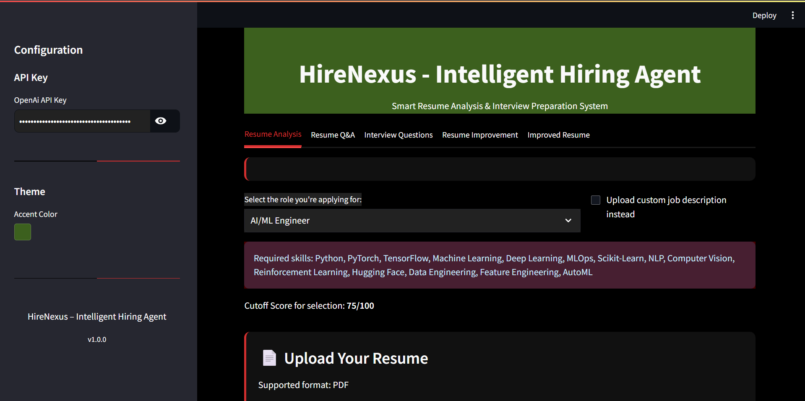
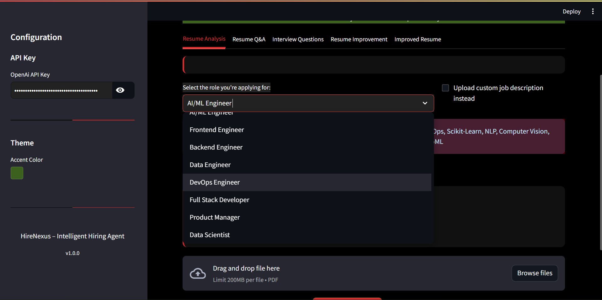

###  Resume Upload & Analysis
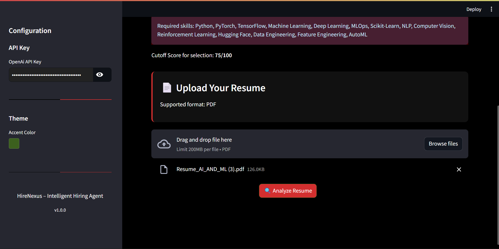
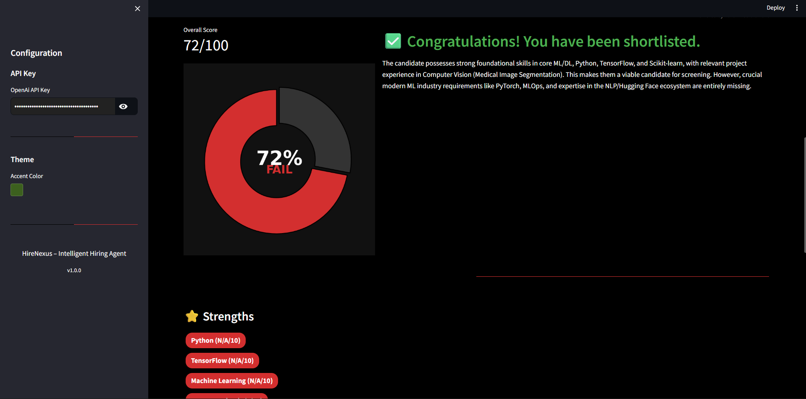
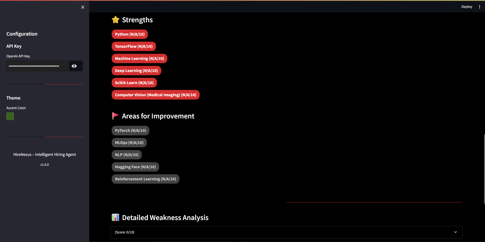
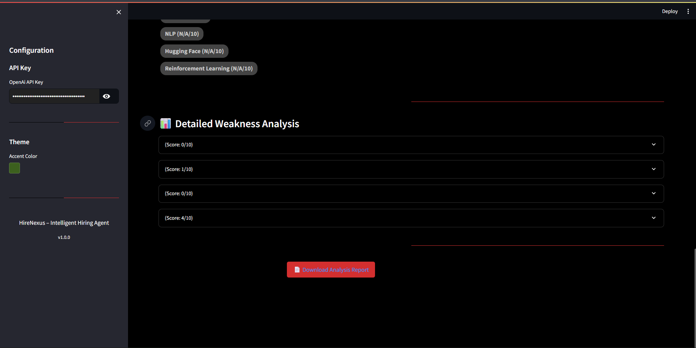

###  Resume Q&A

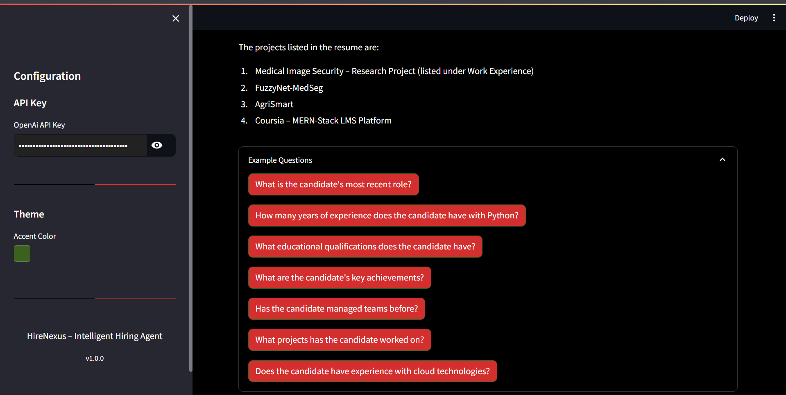

###  Interview Questions
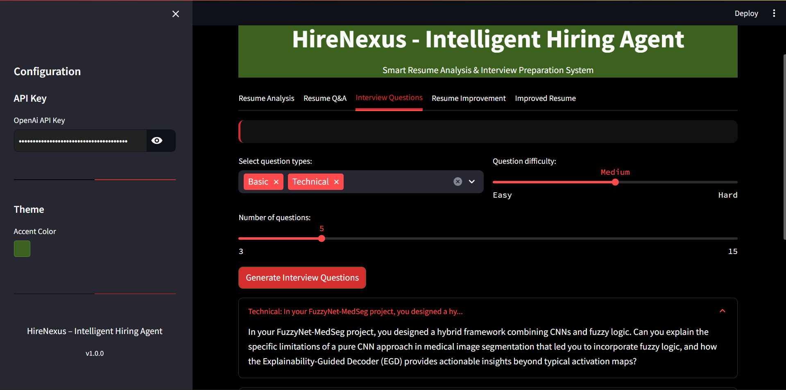


###  Resume Improvement Suggestions
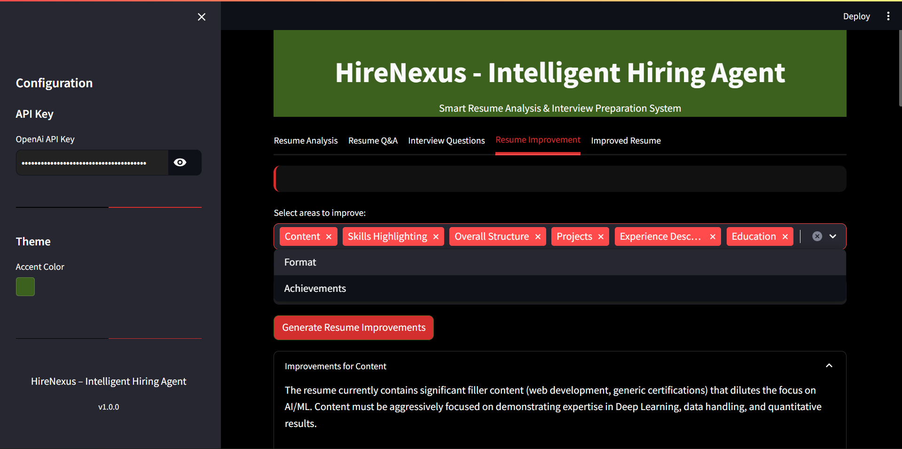
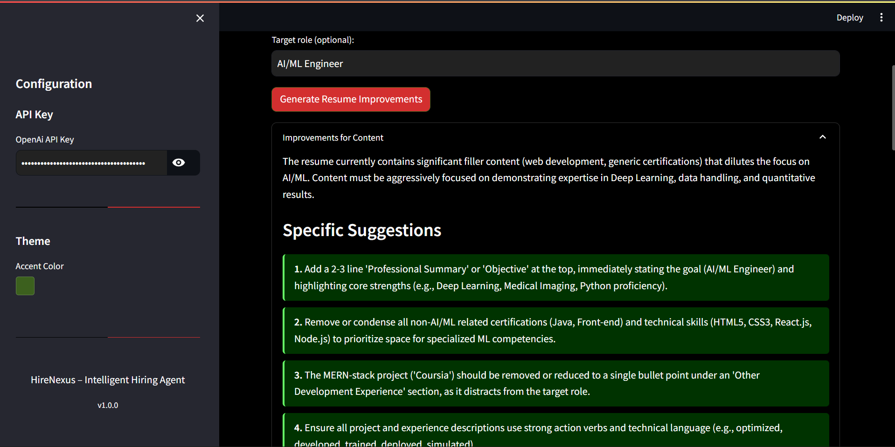
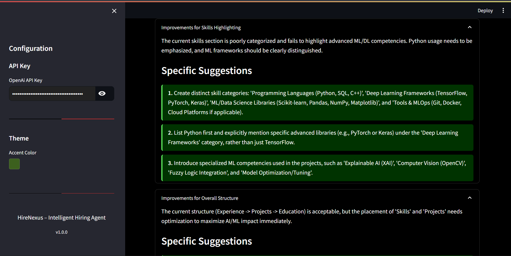
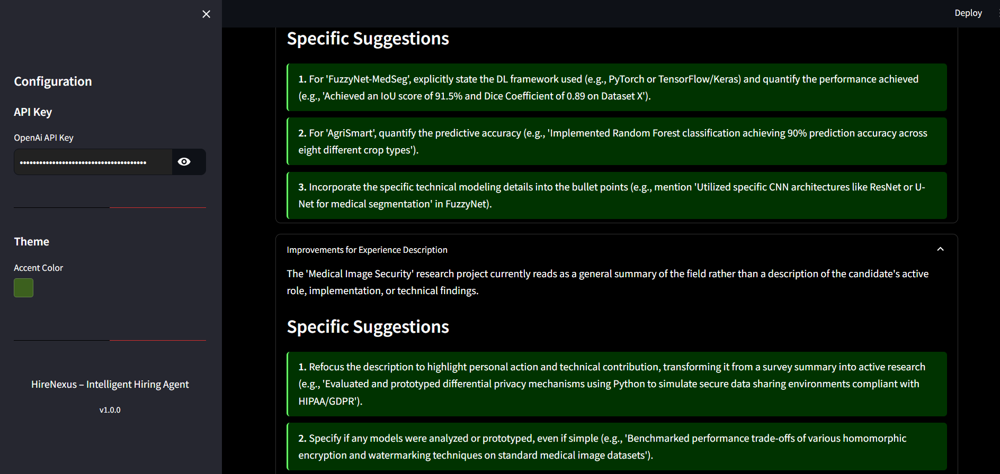
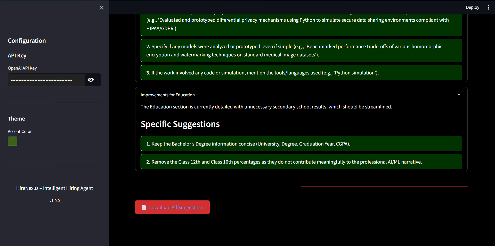

###  Improved Resume Output
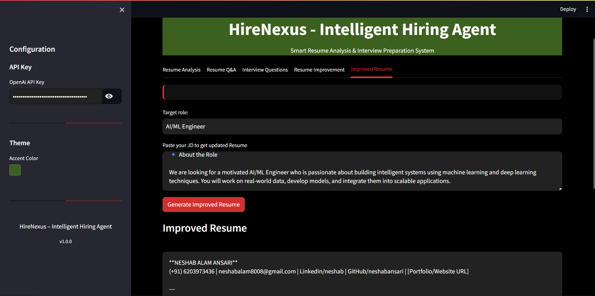
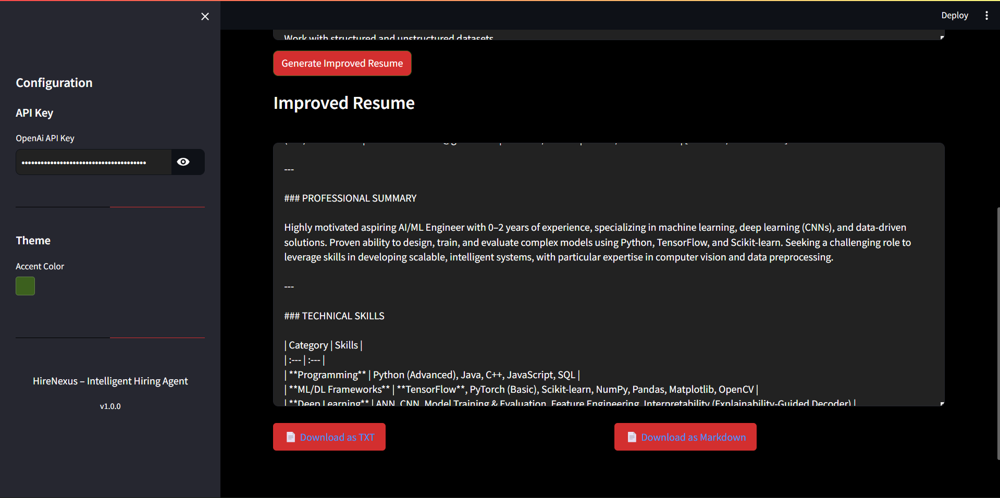

---

## 📂 Project Structure
```

hirenexus-intelligent-hiring-agent/
│
├── app.py # Application controller
├── ui.py # Streamlit UI & components
├── agents.py # AI logic & Gemini integration
├── requirements.txt # Project dependencies
├── README.md # Project documentation
├── .gitignore
└── screenshots/ # Application screenshots
```


---

## ▶️ How to Run Locally

```bash
# 1️⃣ Create & Activate Conda Environment
conda create -n lang3 python=3.11 -y
conda activate lang3

# 2️⃣ Install Dependencies
pip install -r requirements.txt

# 3️⃣ Run the Application
streamlit run app.py
```

---

## Gemini API Key Setup

This project uses Google Gemini API for AI-powered responses.

Step 1: Get Your Gemini API Key
Go to Google AI Studio
Generate an API key for Gemini
Copy the API key

Step 2: Create .env File
Create a file named .env in the project root directory and add:
GEMINI_API_KEY=your_gemini_api_key_here

## License
MIT License
Copyright (c) 2025 Neshab Alam Ansari
